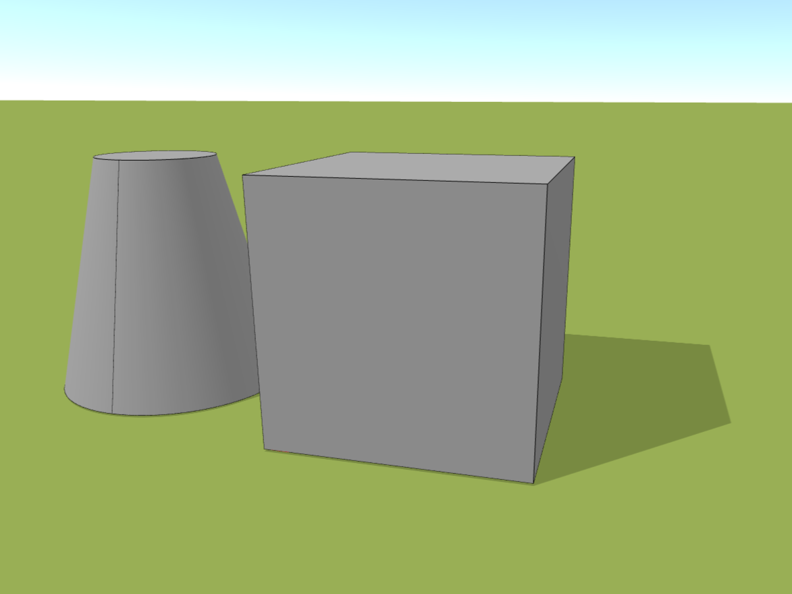

# Volumes

The *Volumes* button allows you to easily add a general volume to your model. Choose from a variety of shapes and then adjust their dimensions to suit your needs. In addition to changing the dimensions, you can edit a number of other properties to give you maximum freedom in creating your models.

