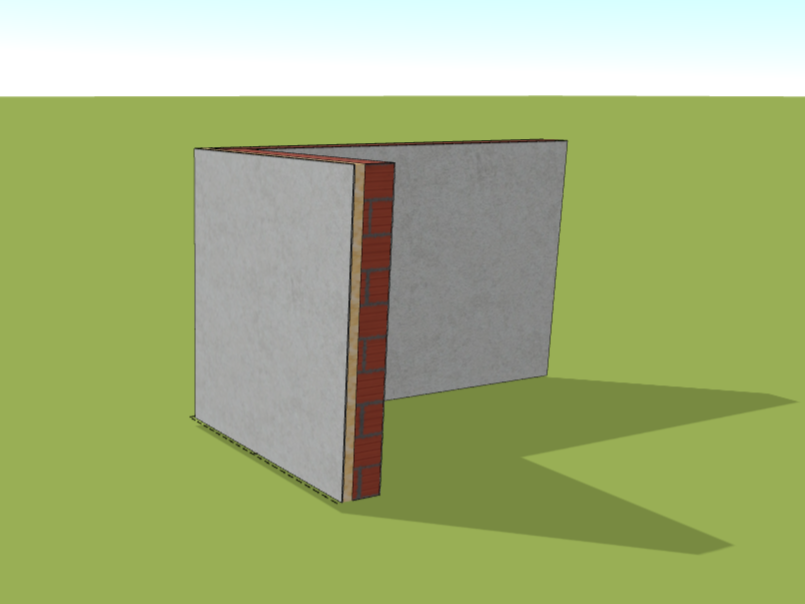

# Wall

The *Wall* button allows you to easily add a wall using a polyline. After adding a wall, you can further use our library to create your own complex wall compositions, including insulation, load bearing elements and view elements.

<!-- [❔Wall composition editing help](layersLibrary.md) -->

