# Geometrie

Obdobně jako v základní úrovni ovládání lze zadat rozměry obdélníkové haly a typ střechy. Pro střechu je navíc dostupná volba Typ střechy - obecná, která umožňuje detailní nastavení střešních rovin, a tedy i více než dvě střešní roviny. 

Řídícím nastavením je počet střešních rovin.
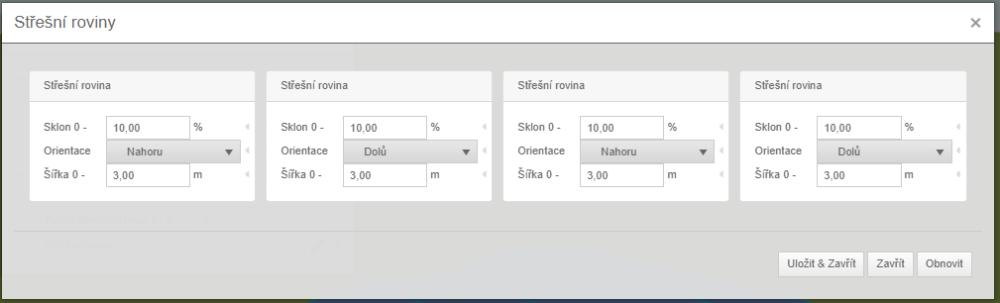

V podrobnějším nastavení lze pak navolit šířku, sklon a směr střešní roviny. Součet šířek střešních rovin musí odpovídat celkové šířce haly.

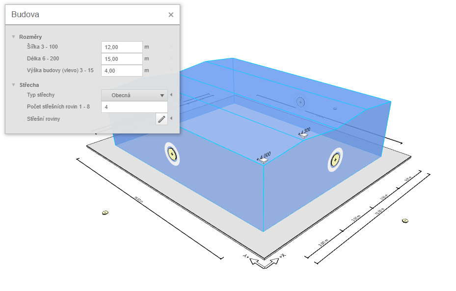

Pomocí obecného nastavení střechy pak můžeme vytvořit asymetrickou sedlovou střechu.
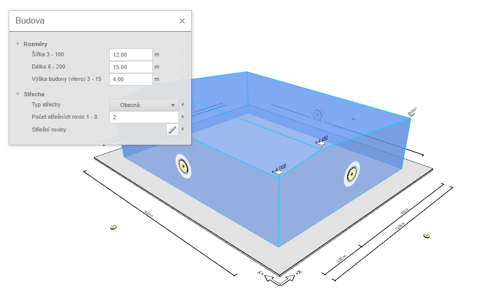

Více možností nabízí i rozšíření půdorysu haly. Na každé stěně haly lze tlačítkem získat nabídku možných rozšíření. Rozměr připojovaného rozšíření, přístavku či budovy se následně zadá jako odsazení od rozměru existující stěny na kterou se budova připojuje.

Rozšíření na bočních stěnách
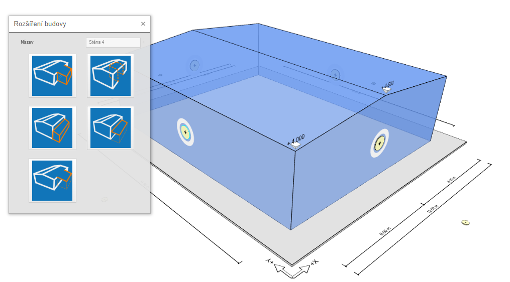

Rozšíření na štítových stěnách
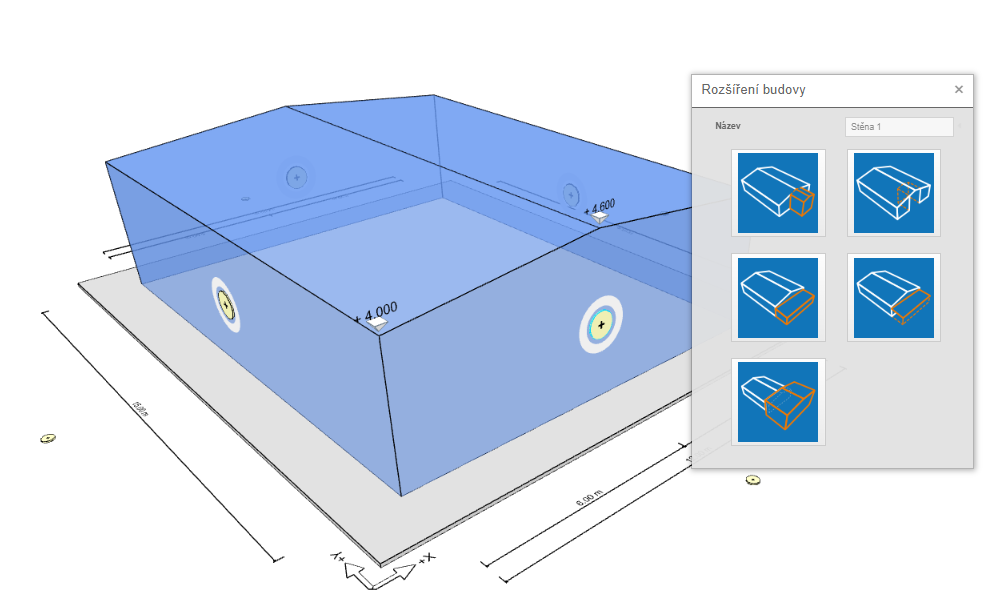

## Rozšíření budovy
Rozšíření budovy lze vložit na každou z hlavních stěn a dále rozšiřuje půdorysný tvar haly.
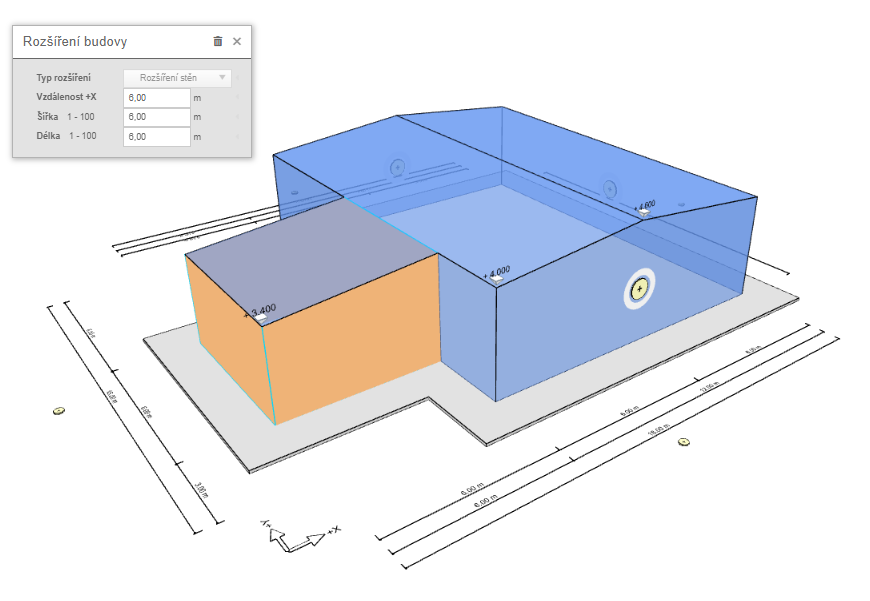

## Výsek budovy
Naopak výsek budovy znamená zmenšení půdorysu haly, zastřešení tohoto prostoru zůstává beze změny.

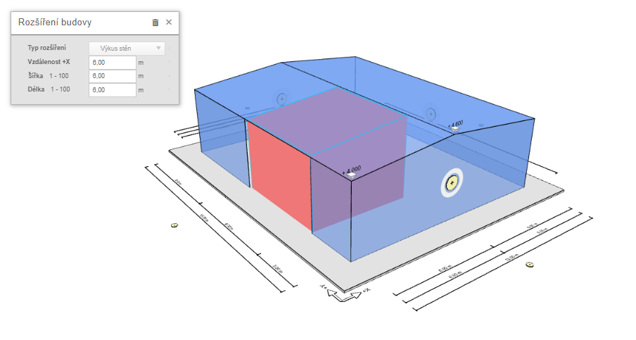

## Rozšíření střechy
Toto nastavení zvětšuje zastřešenou plochu u haly. Toto rozšíření lze zadat pouze na bočních (okapových) stěnách.

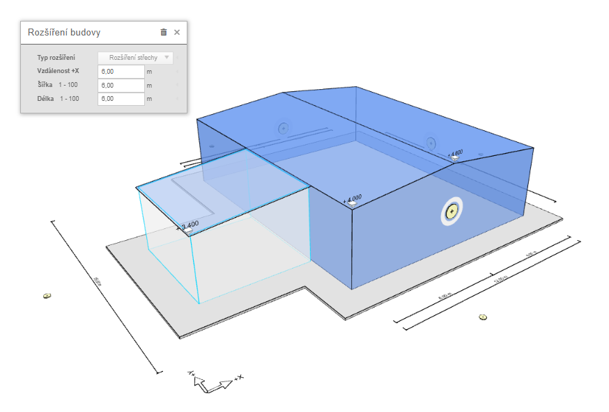

## Přístavek
Na rozdíl od předchozích rozšíření toto umožní přidat další prostor k hale se střechou v jiné úrovni.

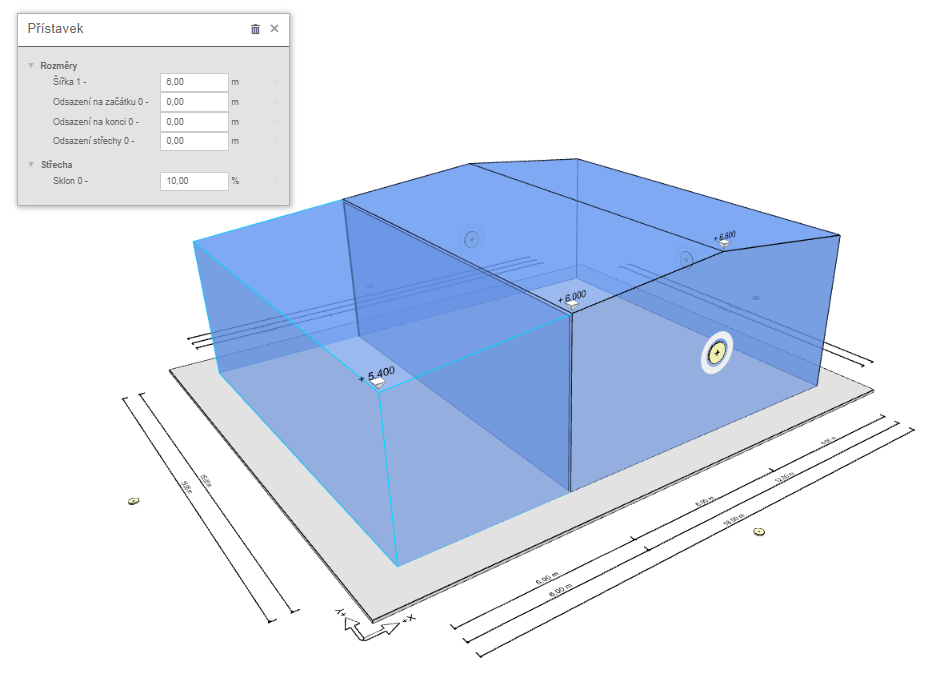

## Otevřený přístavek
Na rozdíl od předchozích rozšíření toto umožní přidat další prostor k hale se střechou v jiné úrovni bez opláštění.

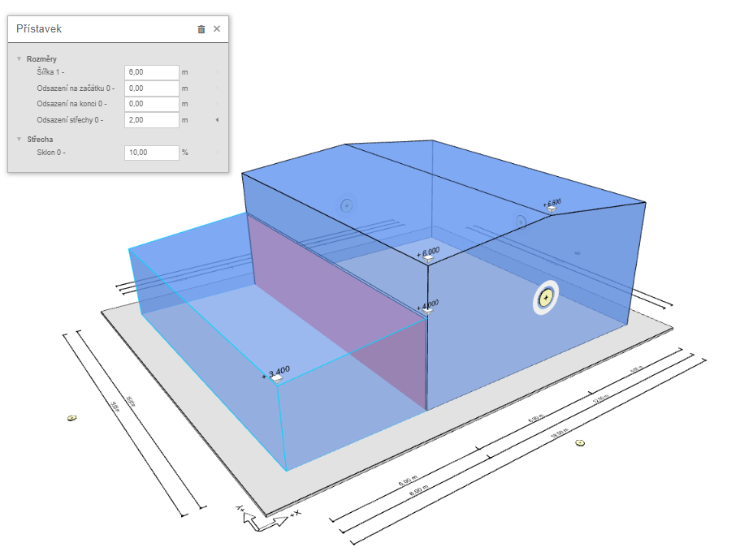

## Budova
Možnost připojení další budovy je umožněna jen pro štítové stěny u specifických šablon. 

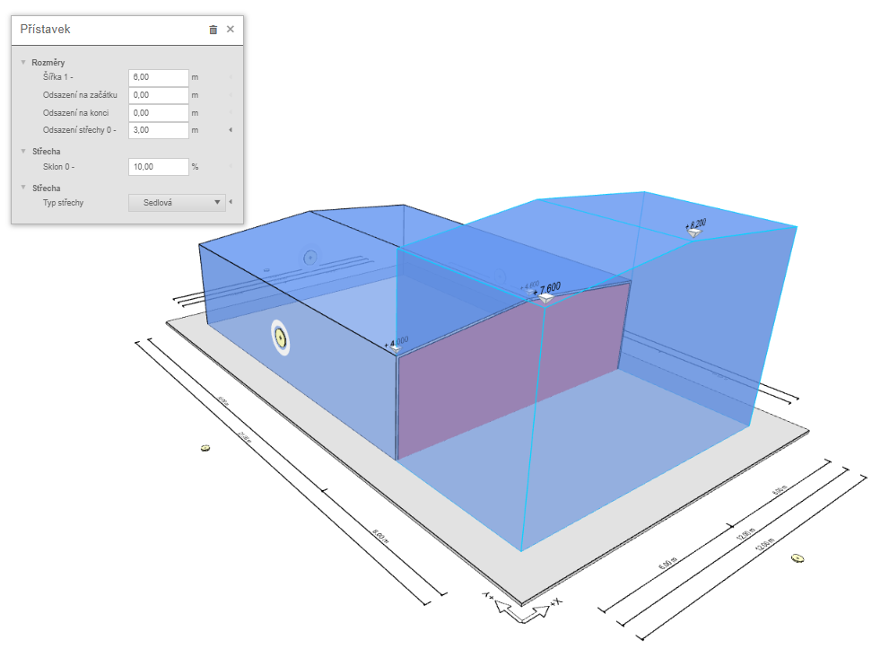
