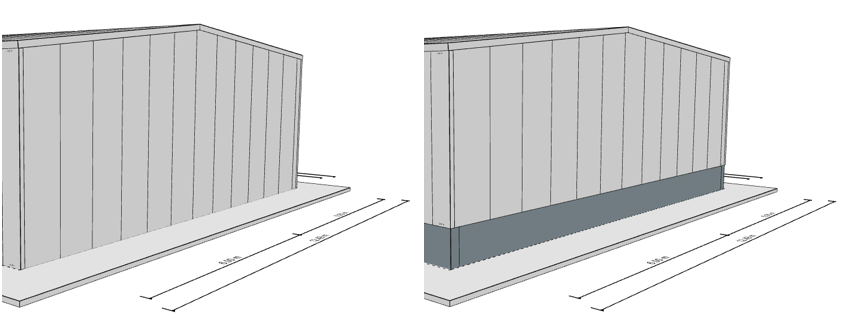
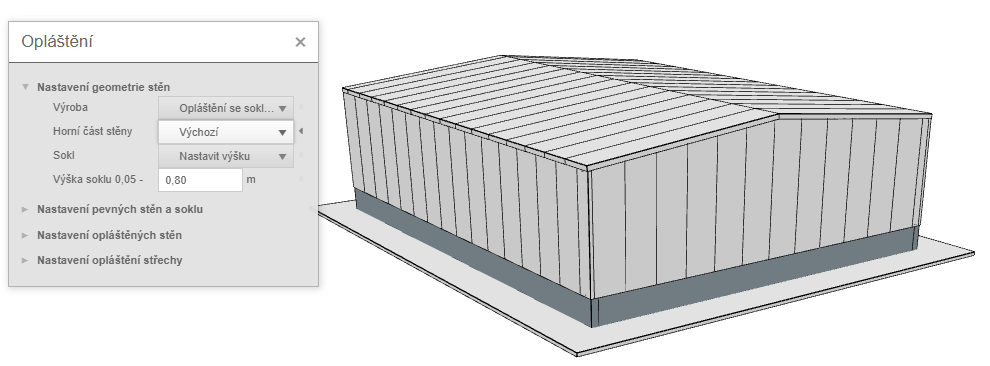
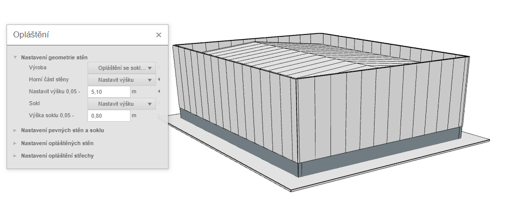
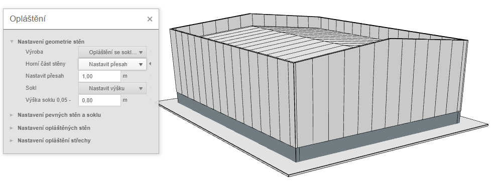
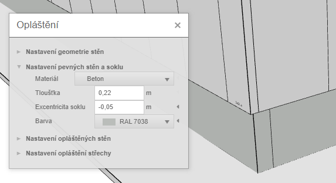
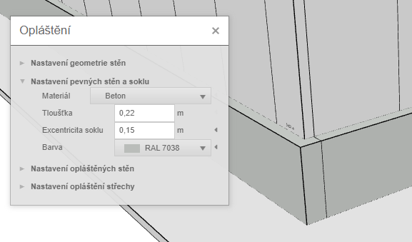

# Nastavení geometrie stěn

Stěna je hlavní částí stěnového opláštění, která se může skládat z více [stěnových dílů](wallPart.md).

## Nastavení typu stěny
Tato nabídka umožní zvolit zejména typ stěny - stěna se soklem a nebo bez a případně výšku soklu.

## Úprava horní části stěny
Navíc lze zvolit úpravu stěny při horní části: 
* _výchozí_ - stěna je dotažená pod střechu, střecha má přesah přes okraj stěny

* _nastavit výšku_ - atiková stěna s fixní výškou. Výšku jednotlivých atikových stěn lze následně zvolit u výběru jedné stěny

* _nastavit přesah_ - atiková stěna s fixním přesahem nad střešní rovinu. Atika kopíruje tvar střechy na styku se stěnou.

## Nastavení soklu
Mimo opláštěné stěny lze doplňkově zvolit objemové stěny z betonu či zdiva a nastavit jejich tloušťku a barvu.
U hal se soklem je možné stavit tloušťku soklu a případnou excentricitu ven (kladné hodnoty) nebo dovnitř haly (záporné hodnoty).

   

