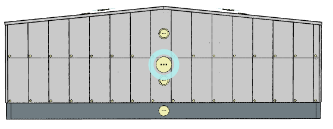

# Opláštění stěnového dílu

Stěnový díl je součástí stěny. Pokud je stěna například složená ze soklu a opláštěné části, má právě dva stěnové díly. Stěnový díl lze dále dělit uživatelským zadáním na [stěnové pásy](wallStrip.md).

## Rozdělení na stěnové pásy
Ve výchozím nastavení není použito dělení na pásy. Lze však rozdělit uživatelským zadáním. 

Příklad opláštěné stěny rozdělené na 2 stěnové pásy:

Obdobně lze dělit i pevné stěny nebo sokl.

Další nastavení se uplatní pro všechny podřízené stěnové pásy:

 - [Opláštění stěny](../mainSettings.md)
 - [Kladení panelů na stěnách](../wallOrientation.md)
 - [Barevná schemata pro vodorovně kladené panely](../wallColorSchemeHorizontal.md)
 - [Barevná schemata pro svisle kladené panely](../wallColorSchemeVertical.md)
 - [Sekundární konstrukce](../wallSecondary.md)
