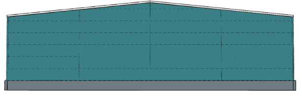

# Barevná schémata pro vodorovně kladené panely

Nastavení stěnového opláštění umožňuje podrobné nastavení barev. Vždy lze volit nastavení barvy zvenčí a zevnitř haly a případně také barvu vzoru pro různá barevná schémata.

## Jednobarevně

## Barva vzoru
Použije se již zadaná barva vzoru

## Barva vzoru na
Předpokládá zadání pořadových čísel řad panelů. Zde příklad při barvě vzoru na 3. a 4. panelu.

## Sudé pruhy

## Každý druhý panel

## Šachovnice

## Sudá pole / Lichá pole

 

## Lichá pole

