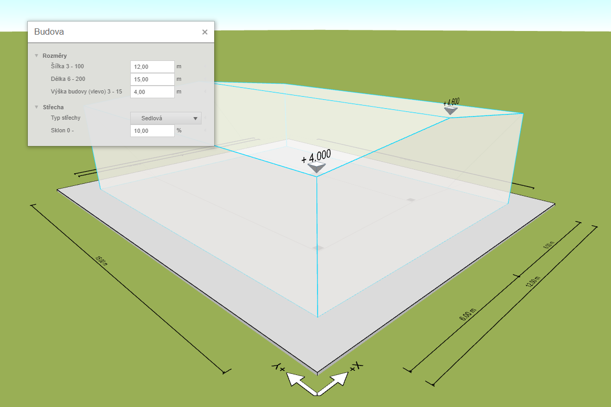
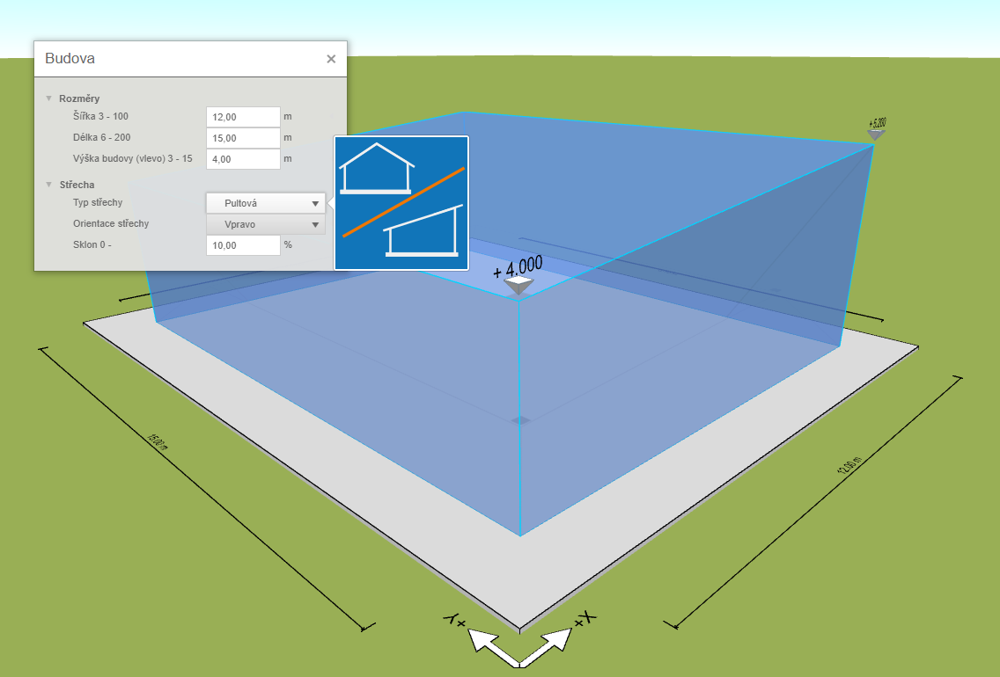

# Nastavení geometrie

Ve základní úrovni ovládání konfigurátor nabízí modelování obdélníkové haly s pultovou nebo symetrickou sedlovou střechou. Zadání rozměrů je snadné, stačí kliknout na model haly a nastavit délku šířku a výšku haly. 

V nastavení střechy pak typ střechy pultová nebo sedlová a její sklon. Pro pultovou střechu jde dále nastavit orientaci.

